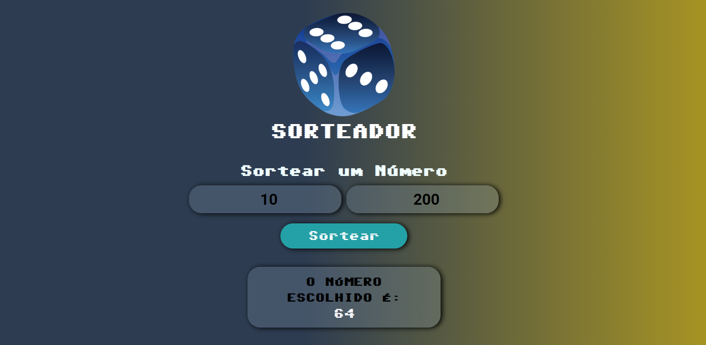

# Projeto Random

Este é um sorteador de números desenvolvido utilizando HTML, CSS e JavaScript.

Para acessar, <a href="https://brunoscm7.github.io/projeto-random/" target="_blank">clique aqui</a>.

Com esta aplicação, é possível determinar entre dois números para ser sortedo. 

Um alerta será disparado se: 

<ul>
  <li>Colocar o primeiro número sendo maior que o segundo;</li>
  <li>Tentar sortear com os campos vazios.</li>
</ul>

